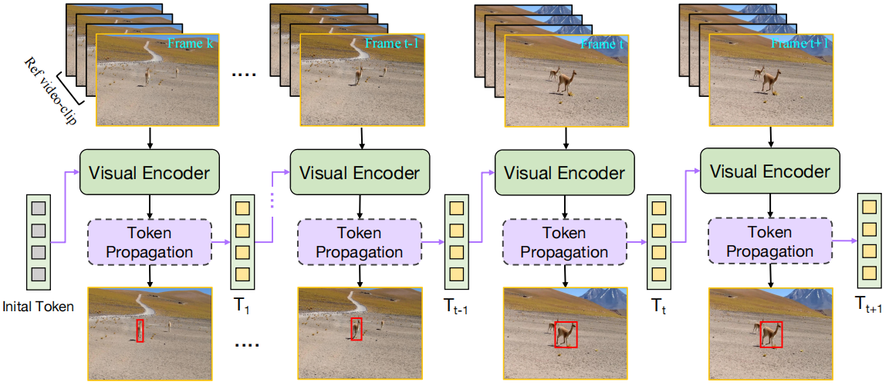

# [AAAI'2024] - ODTrack

The official implementation for the **AAAI 2024** paper \[[_ODTrack: Online Dense Temporal Token Learning for Visual Tracking_](https://arxiv.org/abs/2401.01686)\].

[[Models](https://drive.google.com/drive/folders/17LacrfRO01R75bxU4bgA87eo1b_rX5Gj?usp=sharing)], [[Raw Results](https://drive.google.com/drive/folders/10I7aHb2J4SFTMuQ_LN33VbaiykD_M2hi?usp=sharing)], [[Training logs](https://drive.google.com/drive/folders/1BXnYmnGnSZIA0IR_gwdlDczl0ex4DgFF?usp=sharing)]

<!-- [](https://paperswithcode.com/sota/visual-object-tracking-on-tnl2k?p=seqtrack-sequence-to-sequence-learning-for)
[](https://paperswithcode.com/sota/visual-object-tracking-on-lasot?p=seqtrack-sequence-to-sequence-learning-for)
[](https://paperswithcode.com/sota/visual-object-tracking-on-lasot-ext?p=seqtrack-sequence-to-sequence-learning-for)
[](https://paperswithcode.com/sota/visual-object-tracking-on-trackingnet?p=seqtrack-sequence-to-sequence-learning-for)
[](https://paperswithcode.com/sota/visual-object-tracking-on-got-10k?p=seqtrack-sequence-to-sequence-learning-for)
[](https://paperswithcode.com/sota/visual-object-tracking-on-uav123?p=seqtrack-sequence-to-sequence-learning-for)
[](https://paperswithcode.com/sota/visual-object-tracking-on-needforspeed?p=seqtrack-sequence-to-sequence-learning-for) -->


## Highlights

### :star2: New Video-Level Tracking Framework

<p align="center">
  
</p>

ODTrack is a simple, flexible and effective **video-level tracking pipeline**, which densely associates the contextual relationships of video frames in an online token propagation manner. ODTrack receives video frames of arbitrary length to capture the spatio-temporal trajectory relationships of an instance, and compresses the discrimination features (localization information) of a target into a token sequence to achieve frame-to-frame association. 

This new solution brings the following benefits: 
1. the purified token sequences can serve as prompts for the inference in the next video frame, whereby past information is leveraged to guide future inference

2. the complex online update strategies are effectively avoided by the iterative propagation of token sequences, and thus ODTrack can achieves more efficient model representation and computation.


### :star2: Strong Performance

| Tracker     | GOT-10K (AO) | LaSOT (AUC) | TrackingNet (AUC) | LaSOT_ext (AUC) | VOT2020 (EAO) | TNL2K (AUC) | OTB(AUC) |
|:-----------:|:------------:|:-----------:|:-----------------:|:-----------:|:-----------:|:-----------:|:-----------:|
| ODTrack-L | 78.2         | 74.0        | 86.1              | 53.9          | 0.605          | 61.7          | 72.4          |
| ODTrack-B | 77.0         | 73.1        | 85.1              | 52.4          | 0.581          | 60.9          | 72.3          |


## Install the environment
```
conda create -n odtrack python=3.8
conda activate odtrack
bash install.sh
```


## Data Preparation
Put the tracking datasets in ./data. It should look like:
   ```
   ${PROJECT_ROOT}
    -- data
        -- lasot
            |-- airplane
            |-- basketball
            |-- bear
            ...
        -- got10k
            |-- test
            |-- train
            |-- val
        -- coco
            |-- annotations
            |-- images
        -- trackingnet
            |-- TRAIN_0
            |-- TRAIN_1
            ...
            |-- TRAIN_11
            |-- TEST
   ```


## Set project paths
Run the following command to set paths for this project
```
python tracking/create_default_local_file.py --workspace_dir . --data_dir ./data --save_dir ./output
```
After running this command, you can also modify paths by editing these two files
```
lib/train/admin/local.py  # paths about training
lib/test/evaluation/local.py  # paths about testing
```


## Training
Download pre-trained [MAE ViT-Base weights](https://dl.fbaipublicfiles.com/mae/pretrain/mae_pretrain_vit_base.pth) and put it under `$PROJECT_ROOT$/pretrained_networks` (different pretrained models can also be used, see [MAE](https://github.com/facebookresearch/mae) for more details).

```
python tracking/train.py \
--script odtrack --config baseline \
--save_dir ./output \
--mode multiple --nproc_per_node 4 \
--use_wandb 1
```

Replace `--config` with the desired model config under `experiments/odtrack`.

We use [wandb](https://github.com/wandb/client) to record detailed training logs, in case you don't want to use wandb, set `--use_wandb 0`.


## Test and Evaluation

- LaSOT or other off-line evaluated benchmarks (modify `--dataset` correspondingly)
```
python tracking/test.py odtrack baseline --dataset lasot --runid 300 --threads 8 --num_gpus 2
python tracking/analysis_results.py # need to modify tracker configs and names
```
- GOT10K-test
```
python tracking/test.py odtrack baseline_got --dataset got10k_test  --runid 100 --threads 8 --num_gpus 2
python lib/test/utils/transform_got10k.py --tracker_name odtrack --cfg_name baseline_got_100
```
- TrackingNet
```
python tracking/test.py odtrack baseline --dataset trackingnet  --runid 300 --threads 8 --num_gpus 2
python lib/test/utils/transform_trackingnet.py --tracker_name odtrack --cfg_name baseline_300
```

- VOT2020
```
cd external/vot20/    <workspace_dir>
bash exp.sh
```


## Test FLOPs, and Speed
*Note:* The speeds reported in our paper were tested on a single RTX2080Ti GPU.

```
python tracking/profile_model.py --script odtrack --config baseline
```


## Acknowledgments
* Thanks for the [STARK](https://github.com/researchmm/Stark) and [PyTracking](https://github.com/visionml/pytracking) library, which helps us to quickly implement our ideas.


## Citation
If our work is useful for your research, please consider citing:

```Bibtex
@inproceedings{zheng2024odtrack,
  title={ODTrack: Online Dense Temporal Token Learning for Visual Tracking}, 
  author={Yaozong Zheng and Bineng Zhong and Qihua Liang and Zhiyi Mo and Shengping Zhang and Xianxian Li},
  booktitle={AAAI},
  year={2024}
}
```
